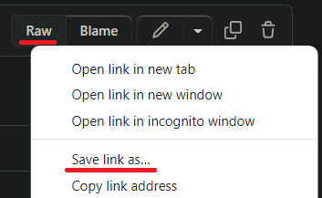
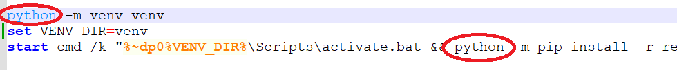
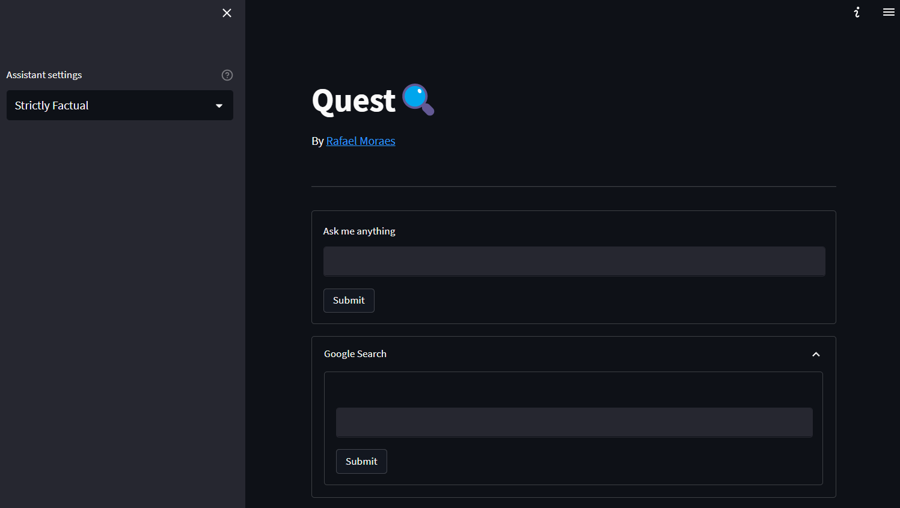
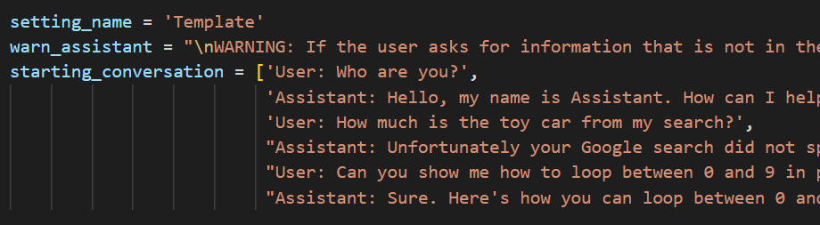

# Quest
 This is a web app that integrates GPT-3 with google searches.

 This analyses the first few results from a google search and stores snippets of text so the Assistant can remember facts. Then you can ask the Assistant about those facts and it will be able to retrive the relevant information gathered previously.

 Anyone willing to help build this tool is welcome to send merge requests.

## Setup

Install [python 3.10](https://www.python.org/downloads/release/python-3100/)

Download the [install.bat](https://github.com/farrael004/Quest/blob/main/install.bat) (Windows) or [install.sh](https://github.com/farrael004/Quest/blob/main/install.sh) (macOS/Linux) file by right clicking the ```Raw``` button and 'Save link As...'.



Put the file where you want the app to be installed.

Double click the `install` file.

## Problems installing?

If when you double-click ```install.bat``` it gives you an error. Open it using notepad and edit the following lines to ```py``` instead of ```python```. Then double-click the ```install.bat``` file again.



## Run locally

To quickly open the app after installation, double-click the `start` file (.bat for Windows and .sh for macOS/Linux). A command shell will open and two links will be displayed. Navigate to any of the two links in your browser.

## Updating

You can update the app to the latest version by double-clicking the `update` file (.bat for Windows and .sh for macOS/Linux).

## Usage

There are three main sections in this app. The 'Assistant settings', the 'Ask me anything', and the 'Google search'.



---
### Google search

To use the Google search box, enter a query in the text input and hit 'Submit'. This will trigger a search on Google using your query. The results will be listed and stored localy. These results can later be used by the Assistant to answer questions.


---
### Ask me anything

Using the most relevant search results and most relevant chat history, the Assistant will answer your query. It's behaviour will be different depending on the settings you chose.


---
### Assistant settings

The Assistant settings serves to determine how the Assistant will behave. If you set it to `Strictly Factual`, it will try to not say any facts beyond the Google searches. `Very Creative` will still use the searches, but allow itself to generate creative responses while being less concerned with factuality.

## Create your own Assistant

There are 5 default settings that can be chosen to customize how factual or creative the Assistant is. However, you can create your own settings to open for many more possibilities. To do this, navigate to the `conversation_settings` folder and open the `_create_setting.py` file.



Inside, you can create the custom settings and give it a name. Then double-click `_create_setting_file` (.bat for Windows and .sh for macOS/Linux).
